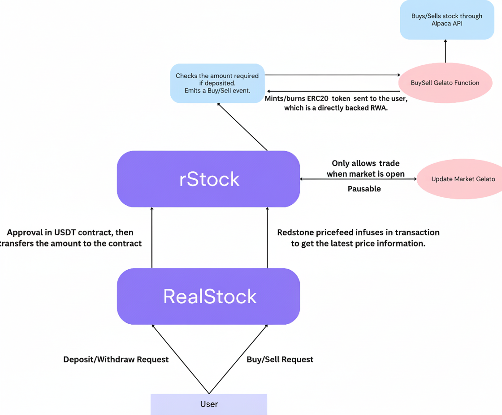

# RealStock

### Directly Backed Trading On-Chain: Real Assets, Real Security

Our project addresses a crucial gap in the current landscape of De-Fi on the blockchain. Traditional synthetic RWAs only mint tokens based on price feeds, creating an abstraction layer that does not connect directly to the underlying assets. Our solution takes a more direct approach by enabling RWAs that are directly backed by real assets.

By utilizing Gelato functions, our platform executes stock purchases off-chain, ensuring that the tokens you hold are genuinely backed by real stocks on the market. This enhances trust, transparency, and the overall value proposition of RWAs on-chain, effectively bridging the gap between traditional finance and blockchain technology.

#### Currently Deployed on Ethereum Sepolia and Supports the Following Stocks:
- [AAPL](https://rootstock-testnet.blockscout.com/address/0x8F78e0fa1A25Eb313408C4c70EfA5c8aAb04556e)
- [AMZN](https://rootstock-testnet.blockscout.com/address/0xD5C035A6e65f3F1445aca33c531B2545A0D3d744)
- [MSFT](https://rootstock-testnet.blockscout.com/address/0xb565656a18bd287a28C6aBEBBcbBdB54DDE37Eeb)
- [S&P500](https://rootstock-testnet.blockscout.com/address/0xDd7E4d53570E998446576c1fFb3C53D2E9b5139F)

### All the contracts use a mock USDT.

#### The flow of the Dapp is as follows:-
- Approve and deposit the suffcient amount of USDT to the contract.
- Select the stock and the correct amount.
- Pyth's price feed wraps the transaction with its oracle data.
- After calling the `buyRStock` function, a `BuyRequest` gets emmitted.
- The event is picked up by Gelato's web3-function, which calls the Alpaca API to buy the respective stock in the exchange.
- It then excutes the `mintRStock` function, which mints the directly backed ERC20 of the RWA on-chain.
- In a similar manner, it can be sold and the USDT can be withdrawn. 



This repository includes the contract and Web3 functions, which need to be deployed separately for testing.

### For Contract:
```
$ forge init // Move the contract to foundry directory
$ forge install redstone-finance/redstone-oracles-monorepo --no-commit
$ forge install OpenZeppelin/openzeppelin-contracts@v4.9.5 --no-commit
```

### For web3-function
```
$ git clone https://github.com/gelatodigital/web3-functions-sdk.git
// Move the stocks and updates folder to web3-function
$ npx hardhat w3f-deploy stocks // to get the typescript function IPFS CID
```

### For web-app
```
$ npm i
$ npm run dev
```


### Environment Variables:
Environment variables are needed for Web3 functions as they use the [Alpaca API](https://app.alpaca.markets/signup) for stock trading.

#### Gelato Deployed Functions:
- [BuyAAPL](https://app.gelato.cloud/functions/0x2a5cfe4d8d9fb067753b03a1a0f9773ee596264bca26ae82362613e0d1f91d0b?type=overview&chainId=31)
- [SellAAPL](https://app.gelato.cloud/functions/0xba86aca916cc942d993d6f8281ce32db63dd01ca2e5eca50b5ee5689ef8205d7?type=overview&chainId=31)
- [BuyAMZN](https://app.gelato.cloud/functions/0x50ca87ef4cf640c496324841820bc011cc98b079c7d6cbac649d69c84942c190?type=overview&chainId=31)
- [SellAMZN](https://app.gelato.cloud/functions/0x37e68337ca3960408f03edd34793a03f28b5698538c1aafceeac1263437ffb5f?type=overview&chainId=31)
- [BuyMSFT](https://app.gelato.cloud/functions/0x7e92a6611935772169985670c170ffcb34cf0e30b42633ad15318c93897e246f?type=overview&chainId=31)
- [SellMSFT](https://app.gelato.cloud/functions/0x617bfe070dfc8f8ffec99b52a9833e7a8e54440a6eb1b6358d8eb0f517b61ebb?type=overview&chainId=31)
- [BuySPY](https://app.gelato.cloud/functions/0xd31022bda965b879ce48725dfc67bb819cbe8f0844b0b79fa584b4028cf866a1?type=overview&chainId=31)
- [SellSPY](https://app.gelato.cloud/functions/0xeb5e7c47ceb2aa3eb72c6795fbf39c79a1645bfc2bc87ef11d98a6e6eaf52221?type=overview&chainId=31)

- **Buy Function**: Listens for `BuyRequest` events, interacts with the Alpaca API to purchase stock, and mints the corresponding ERC20 token to the trader.
- **Sell Function**: Listens for `SellRequest` events, interacts with the Alpaca API to sell stock, and burns the corresponding ERC20 token from the trader.
- **Market Function**: Manages pausing and unpausing of the contract based on market status.